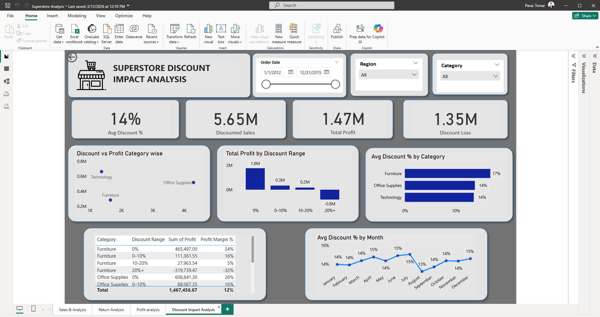
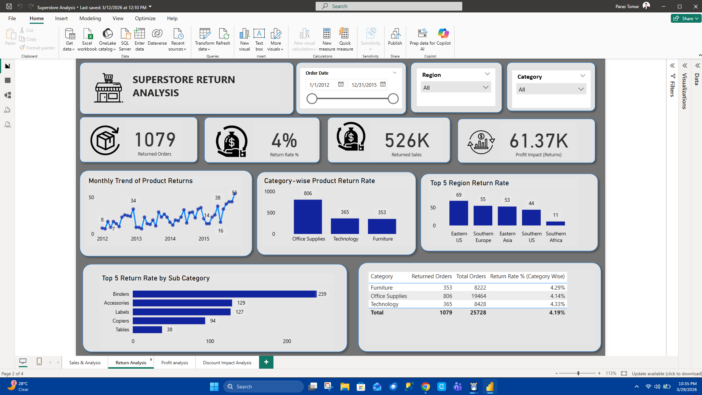

# Superstore Data Analysis Project (SQL | Power BI)

## Project Overview

This project focuses on analyzing **Superstore sales data** to uncover insights related to **sales performance, profitability, customer behavior, and return trends**.

The analysis was performed using **SQL for data exploration and querying** and **Power BI for building an interactive dashboard** to visualize important business metrics.

The objective of this project is to demonstrate how business data can be transformed into **actionable insights for decision-making** using modern data analytics tools.

---

## Tools & Technologies Used

* **SQL (PostgreSQL)** – Data querying and analysis
* **Power BI** – Interactive dashboard and data visualization
* **DAX (Data Analysis Expressions)** – Custom calculations in Power BI
* **GitHub** – Project documentation and version control

---

## Project Files

### Power BI Dashboard
* `Superstore_Analysis.pbix`

### SQL Data Analysis
* `superstore_analysis.sql`

### DAX Measures Documentation
* `powerbi_dax_measures_superstore.xlsx`

### Documentation
* `README.md`

---

## SQL Data Analysis

SQL queries were used to explore and analyze the dataset including:

* Total Sales calculation
* Total Profit calculation
* Category-wise sales analysis
* Regional performance analysis
* Customer segment analysis
* Top performing products

These queries demonstrate **analytical SQL skills and business data exploration**.

---

## Power BI Dashboard

The Power BI dashboard provides interactive insights such as:

* Total Sales Overview
* Total Profit Overview
* Sales by Category and Sub-Category
* Regional Sales Performance
* Customer Segment Analysis
* Monthly Sales Trends
* Return and Discount Analysis

Users can interact with filters and visuals to explore the data dynamically.

---

## DAX Measures

Custom **DAX measures** were created in Power BI to perform advanced calculations including:

* Total Sales
* Total Profit
* Profit Margin
* Other analytical metrics used in the dashboard

A separate Excel file documents all the **DAX formulas used in this project**.

---

## Dashboard Screenshots

To provide a quick visual overview of the project, Power BI dashboard screenshots have been included below. These screenshots highlight the key analytical pages created as part of this project.

### 1. Sales Analysis Dashboard
This dashboard focuses on **sales performance trends, category analysis, and revenue insights**.

---

### 2. Profit Analysis Dashboard
This dashboard highlights **profit trends, profit-driving categories, and profitability insights**.

---

### 3. Discount Analysis Dashboard
This dashboard provides insights into **discount patterns and their impact on sales and business performance**.

---

### 4. Return Analysis Dashboard
This dashboard focuses on **product return trends and return-related business insights**.

> Note: The complete interactive dashboard can be opened using the `Superstore_Analysis.pbix` file in Power BI Desktop.

---

## Key Insights

Some insights identified from the analysis include:

* Identification of top performing product categories
* Regions generating the highest revenue
* Customer segments contributing the most sales
* Profitability differences across product categories
* Discount and return patterns affecting overall business performance

---

## How to Access the Project

1. Download or clone this repository.
2. Open the **Power BI file (.pbix)** using Power BI Desktop.
3. Explore the interactive dashboard and visuals.
4. Review the **SQL analysis file** to understand the queries used.
5. Check the **DAX documentation** to see the formulas used in the Power BI dashboard.
6. Review the **dashboard screenshots** included in this README for a quick visual summary of the project.

---

## Skills Demonstrated

* SQL Query Writing
* Data Analysis
* Power BI Dashboard Development
* DAX Measures
* Data Visualization
* Business Insight Generation
* Analytical Reporting

---

## Author

**Neeti Tomar**

Aspiring Data Analyst skilled in:

* SQL
* Excel
* Power BI
* Data Visualization
* Business Data Analysis
